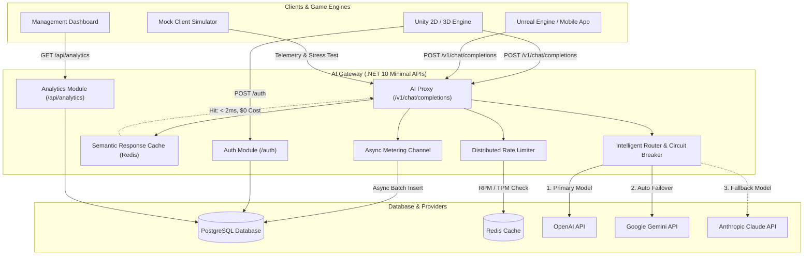

# AI Gateway - Enterprise Multi-Model Router & Governance Platform for Game Developers

Dự án **AI Gateway** là giải pháp cổng kết nối API mã nguồn mở được xây dựng trên nền tảng **.NET 10 ASP.NET Core Minimal APIs**, áp dụng kiến trúc **Clean Architecture** kết hợp với **CQRS (MediatR)**.

Hệ thống đóng vai trò làm trung gian bảo mật, định tuyến thông minh (Intelligent Routing), quản lý hạn ngạch (Distributed Rate Limiting & Virtual Keys), giám sát độ trễ (Latency Monitoring), tự động chuyển đổi dự phòng (Zero-Downtime Failover), ngắt mạch tự động (Polly Circuit Breaker), bộ nhớ đệm ngữ nghĩa (Semantic Response Caching), và thống kê chi phí ($ USD) cho các ứng dụng client (Game Unity 2D/3D, Unreal Engine, ứng dụng di động, thiết bị IoT).

---

## 🎯 1. Lý do chọn Đề tài & Tác dụng đối với Nhà phát triển Game (Game Dev Benefits)

### ❓ **Lý do chọn Đề tài (Motivation)**
Trong kỷ nguyên **Generative AI**, việc tích hợp các mô hình ngôn ngữ lớn (LLM - OpenAI GPT, Google Gemini, Anthropic Claude) vào trò chơi đang mở ra những trải nghiệm đột phá như: **NPC thông minh có cá tính riêng**, **hội thoại động không kịch bản**, và **nhiệm vụ sinh tự động (Procedural Quests)**.

Tuy nhiên, việc kết nối trực tiếp từ Game Client (Unity/Unreal Engine/Mobile App) tới các nhà cung cấp LLM gặp phải **4 thách thức lớn**:
1. **Lộ API Key bí mật**: Nếu nhúng API Key trực tiếp trong client binary (.apk, .exe), kẻ xấu có thể decompile và đánh cắp API Key.
2. **Nguy cơ Cháy ngân sách ($ USD)**: Sự cố vỡ trận chi phí do người chơi spam, hoặc do bug lặp request từ Game Client.
3. **Gián đoạn Trải nghiệm Người chơi (Downtime & Rate Limit 429/5xx)**: Khi một nhà cung cấp LLM gặp sự cố sập server hoặc quá tải limit, hội thoại NPC trong game bị khựng hoặc crash.
4. **Bài toán Tối ưu Chi phí vs. Độ trễ (Latency vs. Cost)**: Các cuộc hội thoại NPC thông thường cần phản hồi cực nhanh (<500ms) với chi phí rẻ, trong khi các sự kiện cốt truyện chính cần suy luận sâu sắc.

---

### 🎮 **Tác dụng của Hệ thống đối với Nhà phát triển Game (Game Developer Impact)**

* **🛡️ Bảo mật Tuyệt đối (Zero API Key Leakage)**:
  * Game Client không bao giờ lưu API Key thực của OpenAI/Gemini/Claude.
  * Client chỉ giao tiếp qua **Virtual Keys** hoặc **JWT Bearer Tokens** ngắn hạn. Toàn bộ API Keys thật được mã hóa **AES-256** an toàn trong Gateway.

* **⚡ Chơi Game Không Gián Đoạn (Zero-Downtime, Auto Failover & Circuit Breaker)**:
  * Bộ định tuyến `IntelligentRouter` tự động catch các lỗi HTTP (401 Unauthorized, 429 Rate Limit, 500/503 Provider Error) và thử ngay mô hình dự phòng (**Fallback Model**) trong cùng một request HTTP.
  * Tích hợp **Polly Circuit Breaker**: Tự động ngắt mạch (State: OPEN) khi phát hiện 3 lỗi liên tiếp từ 1 Provider, bỏ qua Provider bị sập trong 0ms để gọi ngay Fallback Model.

* **💰 Tối ưu hóa Chi phí & Độ trễ (Smart Routing & Semantic Response Caching)**:
  * Hỗ trợ chiến lược **LowestCost** (chọn model rẻ nhất) và **LowestLatency** (chọn model phản hồi nhanh nhất).
  * Tích hợp **Semantic Response Caching**: Tự động chuẩn hóa câu thoại người chơi (lowercase, xóa dấu câu, gom khoảng trắng) để kiểm tra Redis Semantic Cache. Các câu hỏi lặp lại của NPC được trả về ngay lập tức với **độ trễ < 2ms, $0 USD chi phí và 0 tokens**.

* **🚦 Giới hạn Hạn ngạch & Chống Spam Đa Server (Redis Distributed Cache Rate Limiting)**:
  * Giới hạn RPM (Requests Per Minute) và TPM (Tokens Per Minute) trên từng Chìa khóa ảo (Virtual Key).
  * Đồng bộ cache đa máy chủ với **Redis Distributed Cache** và cơ chế tự động chuyển đổi linh hoạt sang **Memory Cache** khi Redis offline.

* **🔒 Phân quyền Mô hình (Model Whitelisting per Key)**:
  * Cho phép gán danh sách các mô hình được phép truy cập (`AllowedModelAliases`) cho từng Virtual Key (ví dụ: Key NPC thường chỉ được gọi `gpt-4o-mini`, Key NPC Boss được phép gọi `gpt-4o`). Trả về `403 Forbidden` khi truy cập trái phép.

* **📊 Quản trị & Giám sát Thời gian Thực (Real-time Game Telemetry & Analytics)**:
  * Báo cáo chính xác số lượng Prompt/Completion Tokens và chi phí ($ USD) tiêu tốn theo từng ngày/tháng, từng Server Game hoặc từng Virtual Key.
  * Giám sát độ khỏe (Provider Health), độ trễ (Latency ms) và tỷ lệ lỗi của từng nhà cung cấp AI.

---

## 🏗️ 2. Sơ đồ Kiến trúc Hệ thống (Architecture Diagram)



---

## ✨ 3. Tính năng Cốt lõi & Cập nhật Mới nhất (Core Features & Recent Updates)

1. **Semantic Response Caching (Bộ nhớ đệm Ngữ nghĩa)**:
   * **Prompt Normalization**: Tự động chuẩn hóa câu thoại (chữ thường, xóa dấu câu, gom khoảng trắng) để tạo SHA-256 Semantic Key `semcache:{model}:{hash}`.
   * **Cache Hit Optimization**: Trả về phản hồi lập tức với **độ trễ < 2ms, 0 prompt tokens, 0 completion tokens và $0 chi phí USD**.
   * **Redis & Memory Fallback**: Lưu cache trên Redis `IDistributedCache` (TTL 24 giờ) với cơ chế fallback tự động sang `IMemoryCache`.

2. **Polly Circuit Breaker (Ngắt mạch Tự động)**:
   * **Auto Trip**: Tự động ngắt mạch (chuyển sang `OPEN` trong 60 giây) khi 1 Provider gặp 3 lỗi 5xx hoặc 429 liên tiếp.
   * **Zero Overhead**: Khi mạch ngắt, bộ định tuyến bỏ qua Provider bị sập trong 0ms để gọi trực tiếp `FallbackModel`.
   * **Half-Open Recovery**: Sau 60 giây, tự động cho phép 1 request thử nghiệm để khôi phục về trạng thái `Closed`.

3. **Bộ định tuyến Thông minh & Automatic In-Request Failover (IntelligentRouter)**:
   * **In-Request Auto Failover**: Tự động gọi mô hình dự phòng (`FallbackModel`) trong cùng 1 cuộc gọi HTTP khi mô hình chính gặp lỗi.
   * **Chiến lược `LowestLatency`**: Định tuyến tới mô hình có thời gian phản hồi trung bình nhanh nhất.
   * **Chiến lược `LowestCost`**: Định tuyến tới mô hình có chi phí $/1k tokens thấp nhất.

4. **Streaming Phản hồi Thời gian Thực (Server-Sent Events - SSE)**:
   * Hỗ trợ cờ `"stream": true` chuẩn giao thức OpenAI API (`text/event-stream`).
   * Phù hợp cho Game Client (Unity 2D/3D, Unreal Engine) hiển thị hiệu ứng chữ chạy từng từ (typewriter effect) mượt mà cho thoại NPC.

5. **Phân tán Rate Limiting với Redis Distributed Cache**:
   * Áp dụng `IDistributedCache` (Redis) cho phép quản lý RPM/TPM đồng bộ giữa nhiều cụm Server Gateway.
   * **Fault-Tolerant Memory Fallback**: Khi kết nối Redis có sự cố, hệ thống tự động ghi nhận warning log và chuyển sang dùng `IMemoryCache` cục bộ, đảm bảo hệ thống luôn hoạt động 24/7.

6. **Quản lý Virtual Keys & Phân quyền Model (Model Whitelisting)**:
   * **Model Access Control**: Phân quyền danh sách mô hình được phép truy cập (`AllowedModelAliases`) cho từng Virtual Key. Trả về `403 Forbidden` khi truy cập mô hình ngoài danh sách.
   * **AES-256 Encryption**: Mã hóa API Keys của các Provider khi lưu trong PostgreSQL.
   * **SHA-256 Hashing**: Hash chìa khóa ảo Virtual Key trước khi xác thực.
   * Giới hạn ngân sách `MaxBudgetUsd`, hạn ngạch `LimitRpm`, `LimitTpm` và thời gian hết hạn (`ExpiresAt`).

7. **Xác thực JWT & Phân quyền Role-Based Access Control (`POST /auth`)**:
   * Cấp phát JWT Bearer Token cho Game Client / thiết bị.
   * Phân quyền Role-Based (`Administrator`, `User`, `NpcClient`).

8. **Giám sát & Báo cáo Analytics (`/api/analytics`)**:
   * **Chi phí & Token (`/cost-usage`)**: Thống kê Prompt/Completion Tokens và chi phí USD theo thời gian.
   * **Chìa khóa Ảo (`/virtual-keys`)**: Thống kê mức độ tiêu dùng của từng Virtual Key.
   * **Sức khỏe Provider (`/provider-health`)**: Giám sát độ trễ (Latency ms), tỷ lệ lỗi 429/5xx của từng mô hình AI.

---

## 🔑 4. Tài khoản & Khóa thử nghiệm (Seed Test Data)

Sau khi khởi chạy, hệ thống tự động khởi tạo các dữ liệu thử nghiệm sau:

| Loại tài khoản / Resource | Email / Identifier | Password / Secret Key | Vai trò (Role) |
| :--- | :--- | :--- | :--- |
| **Administrator Account** | `administrator@localhost` | `Administrator1!` | `Administrator` |
| **Standard User Account** | `testuser@localhost` | `User123!` | `User` |
| **NPC Client Account** | `npcclient@localhost` | `NpcClient123!` | `NpcClient` |
| **Development Virtual Key** | `gw-live-devtestkey1234567890abcdef` | Header: `Authorization: Bearer <key>` | API Access |

---

## ⚡ 5. Hướng dẫn Khởi chạy Nhanh (5-Minute Quick Start Guide)

### **Yêu cầu môi trường:**
* .NET 10.0 SDK
* Docker Desktop (Chạy PostgreSQL & Redis)

### **Các bước thực hiện:**

1. **Khởi chạy Cơ sở dữ liệu PostgreSQL & Redis**:
   ```bash
   docker-compose up -d
   ```

2. **Khởi chạy Hệ thống Backend AI Gateway (qua .NET Aspire)**:
   ```bash
   dotnet run --project .\src\AppHost
   ```
   * Hệ thống tự động tạo Database, áp dụng Migrations và Seed dữ liệu tài khoản thử nghiệm.
   * Giao diện Aspire Dashboard & OpenAPI Swagger sẽ tự động hiển thị tại trình duyệt.

3. **Khởi chạy Ứng dụng Giả lập Mock Client (Kiểm thử Live & Stress Test)**:
   Mở một cửa sổ Terminal mới và chạy:
   ```bash
   dotnet run --project .\src\MockClient
   ```
   * **Nhấn phím `S`**: Bật/tắt chế độ **Stress Test (100ms Interval)** để kích hoạt lỗi `429 Too Many Requests` chứng minh tính năng bảo vệ hạn ngạch.

---

## 🧪 6. Kiểm thử Tự động (Automated Testing & Coverage)

Hệ thống đi kèm bộ kiểm thử tự động bao gồm Unit Tests và Integration Tests toàn diện:

```bash
dotnet test
```

* **Unit Tests (37 tests)**:
  * `SemanticCacheServiceTests`: Kiểm tra chuẩn hóa câu thoại prompt, tạo SHA-256 semantic key trùng khớp, cache miss và set/get hit từ Redis / Memory Cache.
  * `CircuitBreakerServiceTests`: Kiểm tra ngưỡng ngắt mạch 3 lỗi 5xx/429, đếm ngược thời gian ngắt 60s, và tự động khôi phục về trạng thái Closed khi thành công.
  * `IntelligentRouterTests`: Kiểm tra chiến lược định tuyến `LowestCost`, `LowestLatency`, ưu tiên Key, tự động Failover, và cơ chế ngắt mạch Circuit Breaker bypass key bị hỏng.
  * `VirtualKeyServiceTests`: Kiểm tra mã hóa SHA-256 hash, cấp phát Key, phân quyền mô hình `IsModelAllowed`, kiểm tra ngân sách `MaxBudgetUsd` và thời hạn `ExpiresAt`.
  * `RateLimitServiceTests`: Kiểm tra tính năng Rate Limiting với Redis Distributed Cache, kiểm tra giới hạn RPM/TPM và cơ chế tự động fallback về `IMemoryCache`.
* **Integration Tests (4 tests)**:
  * Kiểm thử các API Endpoints thực tế (`/v1/chat/completions`, `/auth`, `/api/analytics`, `/api/route-rules`).
* **Kết quả**: **41/41 tests thành công 100%**.
