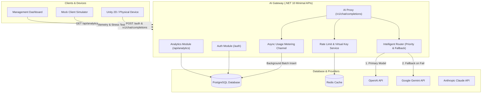

# AI Gateway - Enterprise Multi-Model Router & Governance Platform

Dự án **AI Gateway** là giải pháp cổng kết nối API mã nguồn mở được xây dựng trên nền tảng **.NET 10 ASP.NET Core Minimal APIs**, áp dụng kiến trúc **Clean Architecture** kết hợp với **CQRS (MediatR)**. 

Hệ thống đóng vai trò làm trung gian bảo mật, định tuyến thông minh (Intelligent Routing), quản lý hạn ngạch (Rate Limiting & Virtual Keys), giám sát độ trễ (Latency Monitoring), và thống kê chi phí ($ USD) cho các ứng dụng client (Game Unity 2D, ứng dụng di động, thiết bị IoT).

---

## 🏗️ 1. Sơ đồ Kiến trúc Hệ thống (Architecture Diagram)



---

## ✨ 2. Tính năng Cốt lõi (Key Features)

1. **Xác thực Người dùng & Thiết bị (`POST /auth`)**:
   * Cấp phát chuẩn JWT Bearer Token cho thiết bị vật lý / client.
   * Quản lý phân quyền Role-Based Access Control (`Administrator`, `User`, `NpcClient`).

2. **AI Proxy & Định dạng Đầu ra có Cấu trúc (`POST /v1/chat/completions`)**:
   * Chuẩn hóa giao thức gọi LLM theo OpenAI Specification.
   * Đảm bảo đầu ra trả về định dạng Structured JSON an toàn cho Client/Game Engine.

3. **Bộ định tuyến Thông minh & Tự động Fallback (`RouteRules`)**:
   * Cho phép cấu hình quy tắc định tuyến linh hoạt theo bí danh (`TargetModelAlias`).
   * Tự động chuyển tiếp từ mô hình chính (`PrimaryModel`) sang mô hình dự phòng (`FallbackModel`) khi gặp lỗi quá tải hoặc sự cố nhà cung cấp.

4. **Quản lý Lịch sử Ngữ cảnh Trò chuyện (`GET /conversations`)**:
   * Lưu trữ và truy xuất tức thì các bước hành động/hội thoại của NPC trong Game.

5. **Giám sát & Báo cáo Analytics (`/api/analytics`)**:
   * **Báo cáo Chi phí & Token (`/cost-usage`)**: Thống kê Prompt/Completion Tokens và chi phí USD theo ngày/tháng.
   * **Thống kê Chìa khóa Ảo (`/virtual-keys`)**: Giám sát client nào tiêu tốn nhiều ngân sách nhất.
   * **Sức khỏe Nhà cung cấp (`/provider-health`)**: Giám sát độ trễ trung bình (Latency ms), tỷ lệ lỗi 429/5xx.

6. **Bảo vệ Hệ thống (Rate Limiting & Virtual Keys)**:
   * Giới hạn số lượng request trên phút (RPM) và lượng token trên phút (TPM).
   * Tự động phản hồi HTTP Status `429 Too Many Requests` khi client gọi quá tần suất cho phép.

---

## 🔑 3. Tài khoản & Khóa thử nghiệm (Seed Test Data)

Sau khi khởi chạy, hệ thống tự động khởi tạo các dữ liệu thử nghiệm sau:

| Loại tài khoản / Resource | Email / Identifier | Password / Secret Key | Vai trò (Role) |
| :--- | :--- | :--- | :--- |
| **Administrator Account** | `administrator@localhost` | `Administrator1!` | `Administrator` |
| **Standard User Account** | `testuser@localhost` | `User123!` | `User` |
| **NPC Client Account** | `npcclient@localhost` | `NpcClient123!` | `NpcClient` |
| **Development Virtual Key** | `gw-live-devtestkey1234567890abcdef` | Header: `Authorization: Bearer <key>` | API Access |

---

## ⚡ 4. Hướng dẫn Khởi chạy Nhanh (5-Minute Quick Start Guide)

### **Yêu cầu môi trường:**
* .NET 10.0 SDK
* Docker Desktop (Chạy PostgreSQL & Redis)

### **Các bước thực hiện:**

1. **Khởi chạy Cơ sở dữ liệu PostgreSQL & Redis**:
   ```bash
   docker-compose up -d
   ```

2. **Khởi chạy Hệ thống Backend AI Gateway (qua .NET Aspire)**:
   ```bash
   dotnet run --project .\src\AppHost
   ```
   * Hệ thống tự động tạo Database, áp dụng Migrations và Seed dữ liệu tài khoản thử nghiệm.
   * Giao diện Aspire Dashboard & OpenAPI Swagger sẽ tự động hiển thị tại trình duyệt.

3. **Khởi chạy Ứng dụng Giả lập Mock Client (Kiểm thử Live & Stress Test)**:
   Mở một cửa sổ Terminal mới và chạy:
   ```bash
   dotnet run --project .\src\MockClient
   ```
   * **Nhấn phím `S`**: Để bật/tắt chế độ **Stress Test (100ms Interval)** để kích hoạt lỗi `429 Too Many Requests` chứng minh tính năng bảo vệ hệ thống.

4. **Chạy Bộ kiểm thử tự động (Unit Tests)**:
   ```bash
   dotnet test
   ```

---

## 📑 5. Danh sách API Endpoints Chính

| Phân nhóm | HTTP Method | Endpoint Route | Mô tả chức năng |
| :--- | :---: | :--- | :--- |
| **Auth** | `POST` | `/auth` | Xác thực người dùng/thiết bị vật lý, cấp JWT Token |
| **Auth** | `POST` | `/auth/login` | Đăng nhập tài khoản |
| **AI Proxy** | `POST` | `/v1/chat/completions` | Gửi request gọi LLM định tuyến tự động |
| **Context** | `GET` | `/conversations` | Truy vấn lịch sử ngữ cảnh hội thoại NPC |
| **Context** | `POST` | `/conversations/add` | Thêm tin nhắn ngữ cảnh mới |
| **Analytics**| `GET` | `/api/analytics/cost-usage` | Báo cáo chi phí USD & Token tiêu tốn |
| **Analytics**| `GET` | `/api/analytics/virtual-keys` | Thống kê tiêu dùng theo chìa khóa ảo |
| **Analytics**| `GET` | `/api/analytics/provider-health` | Giám sát độ trễ ms & tỷ lệ lỗi 429/5xx nhà cung cấp |
| **RouteRules**| `GET` | `/api/route-rules/all` | Danh sách quy tắc định tuyến mô hình |
| **RouteRules**| `POST` | `/api/route-rules/create` | Tạo quy tắc định tuyến mô hình mới |